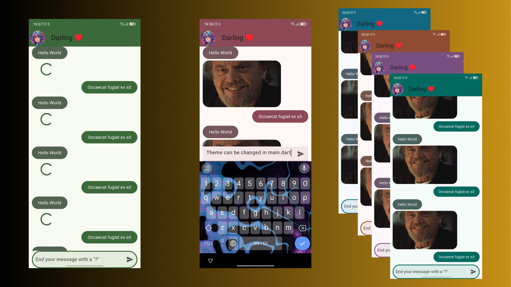

# Simple Chat App

# Info
A chat whit images and text fields application (non functional, just design)  made with Flutter to learn about front-end development, this application is the second exercise of the Udemy Flutter course led by Full-Stack Developer & Teacher Fernando Herrera

#Topics learned
- TextEditingControllers
- Focus Nodes
- ThemeData
- Containers
- ListViews
- Expanded
- Image
- ClipRRect

# Udemy Course
If you're interested in learning this course, you can do so at:

https://www.udemy.com/course/flutter-cero-a-experto/

